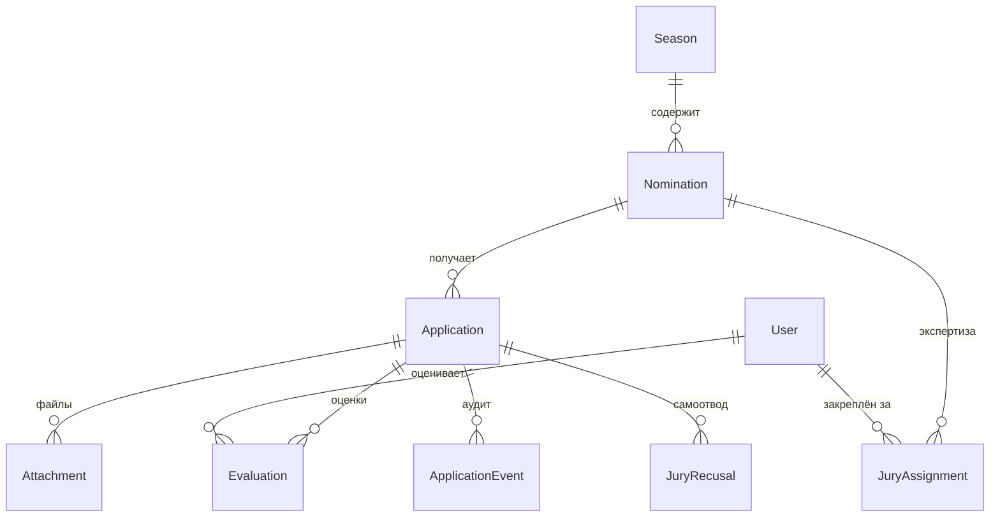

<p align="center">
  
</p>

<h1 align="center">Национальная премия «Труд крут»</h1>

<p align="center">
  <strong>Веб-сервис проведения ежегодной национальной премии в поддержку трудоустройства молодёжи</strong><br/>
  Организатор: МОО «Российские студенческие отряды»
</p>

<p align="center">
  <a href="https://премиятрудкрут.рф"></a>
  
  
  
  
  
</p>

<p align="center">
  
  
  
  
</p>

---

## Обзор

Платформа для проведения **Национальной премии «Труд крут»** — ежегодной награды за достижения в сфере трудоустройства молодёжи в движении российских студенческих отрядов.

Система охватывает **полный цикл**: от публичного приёма заявок через экспертную оценку жюри до церемонии награждения.

```
┌─────────────────────────────────────────────────────────────────────┐
│                        АРХИТЕКТУРА ПЛАТФОРМЫ                        │
├──────────────┬──────────────────┬──────────────────┬────────────────┤
│   ЛЕНДИНГ    │    ЗАЯВКИ        │    АДМИНКА       │    ЖЮРИ        │
│              │                  │                  │                │
│  • Hero      │  • 3-step wizard │  • Таблица       │  • Закреплённые │
│  • 13 номин. │  • Динам. поля   │  • Статусы       │    заявки      │
│  • Таймер    │  • SmartCaptcha  │  • Рейтинг       │  • Оценка      │
│  • Статист.  │  • S3 загрузка   │  • XLSX экспорт  │    по критериям│
│  • Навигац.  │  • Валидация     │  • Рассылка      │  • Прогресс    │
│              │                  │  • Протокол      │  • Самоотвод   │
├──────────────┴──────────────────┴──────────────────┴────────────────┤
│                    API LAYER (Next.js Server Actions)               │
├─────────────────────────────────────────────────────────────────────┤
│              PostgreSQL  ·  Prisma ORM  ·  S3 Storage               │
│              NextAuth v5  ·  Zod  ·  SMTP  ·  Telegram Bot         │
└─────────────────────────────────────────────────────────────────────┘
```

---

## Технический стек

<table>
<tr>
<td width="50%">

### Frontend
| Технология | Версия | Назначение |
|:---|:---:|:---|
| **Next.js** | 16.2 | App Router, SSR, Turbopack |
| **React** | 19.2 | UI-компоненты |
| **TypeScript** | 5.x | Типизация |
| **Tailwind CSS** | 4.x | Утилитарные стили |
| **shadcn/ui** | — | UI-компоненты (Radix Nova) |
| **Motion** | 12.x | Анимации (Framer Motion) |
| **Recharts** | 3.10 | Графики аналитики |
| **Phosphor Icons** | — | Иконки |
| **Zod** | 4.4 | Валидация схем |

</td>
<td width="50%">

### Backend & Infra
| Технология | Версия | Назначение |
|:---|:---:|:---|
| **Prisma** | 7.9 | ORM + миграции |
| **PostgreSQL** | 16 | Реляционная БД |
| **NextAuth** | v5 beta | Авторизация (credentials) |
| **S3** | — | Хранилище файлов (Yandex OS) |
| **Nodemailer** | 8.x | SMTP-рассылки |
| **bcryptjs** | 3.x | Хэширование паролей |
| **ExcelJS** | 4.4 | XLSX-экспорт |
| **Playwright** | 1.62 | E2E-тесты |
| **Vitest** | 4.1 | Unit-тесты |

</td>
</tr>
</table>

### Инфраструктура

```
┌─────────────────────────────────────────┐
│           Ubuntu VPS (Russia)           │
│         152-Φ compliant hosting         │
├─────────────────────────────────────────┤
│                                         │
│  nginx (443/80)                         │
│    ├── SSL: Let's Encrypt (auto-renew)  │
│    └── proxy → 127.0.0.1:3000           │
│                                         │
│  Next.js (Node 20 LTS)                 │
│    └── systemd: premia.service          │
│                                         │
│  PostgreSQL 16                          │
│    └── daily pg_dump (14-day rotation)  │
│                                         │
│  Yandex Object Storage                  │
│    └── file attachments (pre-signed)    │
│                                         │
└─────────────────────────────────────────┘
```

---

## Модель данных



| Модель | Записей | Описание |
|:---|:---:|:---|
| `User` | — | Участники, жюри, админы, суперадмины |
| `Season` | 1 | Сезон премии с окном приёма и весами |
| `Nomination` | 13 | Номинации с динамической JSON-схемой формы |
| `Application` | 100+ | Заявки с 8 статусами жизненного цикла |
| `Attachment` | — | Файлы (S3 или локально) |
| `Evaluation` | — | Оценки жюри по критериям (JSON scores) |
| `JuryAssignment` | — | Закрепление эксперта за номинацией |
| `JuryRecusal` | — | Самоотвод при конфликте интересов |
| `ApplicationEvent` | — | Аудит-журнал: кто/что/когда |
| `LoginEvent` | — | Журнал входов (успешные/неуспешные, IP) |

### Жизненный цикл заявки

```
   ┌──────┐     ┌────────┐     ┌────────┐     ┌─────────┐
   │ new  │────▶│ review │────▶│scoring │────▶│finalist │──┐
   └──────┘     └────────┘     └────────┘     └─────────┘  │
        │             │                                  │
        │             ▼                                  ▼
        │        ┌──────────┐                      ┌────────┐
        └───────▶│revision  │                      │ winner │
                 └──────────┘                      └────────┘
                        │
                        ▼
                 ┌──────────┐
                 │ rejected │
                 └──────────┘
```

---

## Номинации (Сезон 2026)

<table>
<tr><td>

**Категория «Работодатели»**
1. Лучший работодатель для трудоустройства несовершеннолетних (14–18)
2. Лучший работодатель по обеспечению безопасных условий труда молодёжи
3. Лучшая практика студенческих отрядов в вузах
4. Лучшая практика в общеобразовательных и профессиональных организациях

</td><td>

**Категория «Партнёры и НКО»**
5. Партнёр / НКО «Работа с душой»
6. Лучший региональный совет ветеранов
7. Специальная номинация «Герой РСО»
8. Персональная номинация «Лидер РСО»

</td></tr>
<tr><td>

**Категория «Органы власти»**
9. Лучший орган исполнительной власти по поддержке студотрядов
10. Лучшая практика поддержки молодёжных трудовых отрядов

</td><td>

**Категория «СМИ»**
11. «Мастер слова — Событие года»
12. «Мастер слова — Событие РСО в регионе»
13. «Единство в деле: Трудовой сезон РСО в фокусе»

</td></tr>
</table>

---

## Ключевые фичи

### Для участников
| Фича | Описание |
|:---|:---|
| **Тёмный лендинг** | Анимированная страница с таймером, 3D-эффектами, live-статистикой из БД |
| **3-step wizard** | Пошаговая форма: выбор номинации → заполнение данных → отправка |
| **Динамические поля** | Форма рендерится из JSON-схемы номинации — без правок кода |
| **SmartCaptcha** | Защита Яндексом от ботов при подаче заявок |
| **Личный кабинет** | Статус заявки, экспертные комментарии, скачивание сертификата |
| **Статус-чекер** | Публичная проверка статуса по ID + email без авторизации |
| **Сертификат** | A4-сертификат финалиста/победителя с QR-верификацией |

### Для администраторов
| Фича | Описание |
|:---|:---|
| **Управление заявками** | Таблица с фильтрами, карточка, 8 статусов, аудит-журнал |
| **Жюри-менеджер** | Авто-создание учёток, назначение на номинации, гранулярные права |
| **Рейтинг** | Автоподсчёт средних баллов, номинирование победителей |
| **XLSX экспорт** | Выгрузка всех заявок в Excel |
| **Протокол** | A4-документ для церемонии награждения (победители + финалисты) |
| **Рассылка** | Массовая отправка писем с фильтрами по статусу/номинации |
| **Супер-панель** | KPI, health-check БД, логи входов, система, метрики |

### Для жюри
| Фича | Описание |
|:---|:---|
| **Закреплённые заявки** | Видит только свои назначения |
| **Оценка по критериям** | Баллы по JSON-критериям номинации + комментарий |
| **Blind scoring** | Режим скрытия данных заявителя (анонимная экспертиза) |
| **Прогресс** | Визуальный индикатор «оценено N из M» |
| **Самоотвод** | Откат при конфликте интересов |

---

## Дизайн-система

### Палитра RSO

```
┌──────────────────────────────────────────────────────────────────┐
│                                                                  │
│   ██████████  #0804FF  PRIMARY (RSO Blue)                       │
│   ██████████  #FFFFFF  WHITE                                     │
│   ██████████  #000000  BLACK                                    │
│   ██████████  #EEEEEE  GRAY                                     │
│                                                                  │
│   DIRECTION PALETTES                                             │
│   ████████  Orange   (light / main / dark)                      │
│   ████████  Sky      (light / main / dark)                      │
│   ████████  Coral    (light / main / dark)                      │
│   ████████  Blue     (light / main / dark)                      │
│   ████████  Green    (light / main / dark)                      │
│   ████████  Cyan     (light / main / dark)                      │
│   ████████  Purple   (light / main / dark)                      │
│   ████████  Red      (light / main / dark)                      │
│                                                                  │
└──────────────────────────────────────────────────────────────────┘
```

### Типографика

| Роль | Шрифт | CSS-переменная |
|:---|:---|:---|
| Display / Hero | **Actay Wide** | `--font-actay` |
| Заголовки | **Stolzl** | `--font-stolzl` |
| Основной текст | **Onest** | `--font-onest` |

### Мета-данные статусов

| Статус | Цвет | Значок | Описание |
|:---|:---|:---:|:---|
| `new` | 🔵 Синий | `+` | Новая заявка |
| `queued` | 🟡 Жёлтый | `⧖` | В очереди на рассмотрение |
| `review` | 🟠 Оранжевый | `◉` | На рассмотрении |
| `revision` | 🔴 Красный | `⟳` | На доработке |
| `scoring` | 🟣 Фиолетовый | `★` | На оценке жюри |
| `finalist` | 🟢 Зелёный | `◆` | Финалист |
| `winner` | 🟡 Золотой | `♛` | Победитель |
| `rejected` | ⚫ Серый | `✕` | Отклонена |

---

## Безопасность и комплаенс

```
┌─────────────────────────────────────────────────────────┐
│                  SECURITY LAYERS                        │
├─────────────────────────────────────────────────────────┤
│                                                         │
│  TRANSPORT        HSTS (2y) + Let's Encrypt TLS        │
│  ─────────────    ────────────────────────────────      │
│  HEADERS          CSP / X-Frame-Options: DENY           │
│  ─────────────    X-Content-Type-Options: nosniff       │
│  AUTH             NextAuth v5 + bcrypt + JWT             │
│  ─────────────    Server-side role check (every route)  │
│  RATE LIMIT       In-memory anti-brute-force (login)    │
│  ─────────────    Per-IP + per-email tracking           │
│  CAPTCHA          Yandex SmartCaptcha                   │
│  ─────────────    Applied to application submission     │
│  VALIDATION       Zod (server + client, double-check)   │
│  ─────────────    INN 10/12, OGRN, email, phone         │
│  AUDIT            ApplicationEvent (every mutation)     │
│  ─────────────    LoginEvent (success/fail + IP + UA)   │
│  DATA             152-Φ compliant:                      │
│  ─────────────    RU hosting + RU S3 + consent checkbox │
│  BACKUP           Daily pg_dump, 14-day rotation        │
│                                                         │
└─────────────────────────────────────────────────────────┘
```

---

## Деплой

### Первоначальная настройка

```bash
# 1. Клонировать на сервер
ssh root@<server>
cd /var/www
git clone https://github.com/ykvlev/Premia-RSO.git premia
cd premia

# 2. Установить зависимости
npm install

# 3. Настроить окружение
cp .env.example .env
nano .env   # заполнить DATABASE_URL, S3, SMTP, AUTH_SECRET

# 4. Инициализировать БД
npx prisma generate
npx prisma migrate deploy
npx prisma db seed

# 5. Собрать и запустить
npm run build
sudo systemctl enable --now premia
```

### Ежедневный деплой (автоматический)

```bash
# deploy-ssh.sh (с локальной машины)
rsync -az --partial ./ root@<server>:/var/www/premia/ \
  --exclude node_modules --exclude .next --exclude .env
ssh root@<server> "cd /var/www/premia && \
  npx prisma generate && \
  npx prisma migrate deploy && \
  npm run build && \
  systemctl restart premia"
```

### Бэкапы

```bash
# Ежедневный pg_dump (cron: 03:00 MSK)
pg_dump -U trudkrut trud_krut | gzip > /backups/premia_$(date +%F).sql.gz

# Ротация: удаление файлов старше 14 дней
find /backups -name 'premia_*.sql.gz' -mtime +14 -delete
```

---

## Структура проекта

```
Premia-RSO/
├── app/                        # Next.js App Router
│   ├── (public)/               # Публичные страницы
│   │   ├── page.tsx            # Лендинг
│   │   ├── apply/              # Форма подачи заявок
│   │   ├── status/             # Проверка статуса
│   │   ├── pobediteli/         # Зал победителей
│   │   └── certificate/        # Сертификаты + верификация
│   ├── admin/                  # Админ-панель
│   │   ├── applications/       # Управление заявками
│   │   ├── jury/               # Управление жюри
│   │   ├── ranking/            # Рейтинговая доска
│   │   ├── protocol/           # Протокол награждения
│   │   ├── export/             # XLSX экспорт
│   │   ├── mailing/            # Рассылка
│   │   └── super/              # Супер-админ панель
│   ├── jury/                   # Кабинет жюри
│   ├── cabinet/                # Личный кабинет участника
│   └── api/                    # API routes (NextAuth)
├── components/                 # React-компоненты
│   ├── landing/                # Лендинг (dark-landing.tsx)
│   ├── admin/                  # UI админки
│   ├── apply/                  # Форма заявки + SmartCaptcha
│   ├── jury/                   # UI жюри
│   └── ui/                     # shadcn/ui primitives
├── lib/                        # Бизнес-логика
│   ├── db.ts                   # Prisma-клиент (singleton)
│   ├── brand.ts                # RSO brandbook
│   ├── regions.ts              # 68 регионов РФ
│   ├── storage.ts              # S3 / local file storage
│   ├── email.ts                # HTML-шаблоны писем
│   ├── mail.ts                 # Nodemailer transport
│   ├── captcha.ts              # Яндекс SmartCaptcha
│   ├── rate-limit.ts           # Anti-brute-force
│   ├── observability.ts        # Метрики, ошибки
│   └── telegram.ts             # Telegram-бот уведомления
├── prisma/                     # Схема + миграции + seed
├── scripts/                    # Утилиты (бэкап, дедлайн)
├── tests/                      # Vitest unit-тесты
├── docs/                       # Дизайн-токены,LEGAL, деплой
├── deploy.sh                   # Серверный деплой
├── deploy-ssh.sh               # SSH-деплой с Мака
└── proxy.ts                    # Dev-прокси
```

---

## Быстрый старт (разработка)

```bash
# Клонировать
git clone https://github.com/ykvlev/Premia-RSO.git
cd Premia-RSO

# Установить зависимости
npm install

# Настроить БД
cp .env.example .env
# заполнить DATABASE_URL

# Миграции + seed
npx prisma generate
npx prisma migrate dev
npx prisma db seed

# Запустить dev-сервер
npm run dev
# → http://localhost:3000
```

---

## Лицензия

Частный проект. Все права защищены. © МОО «Российские студенческие отряды»

<p align="center">
  <sub>Сделано с ❤️ для российского молодёжного движения</sub>
</p>
